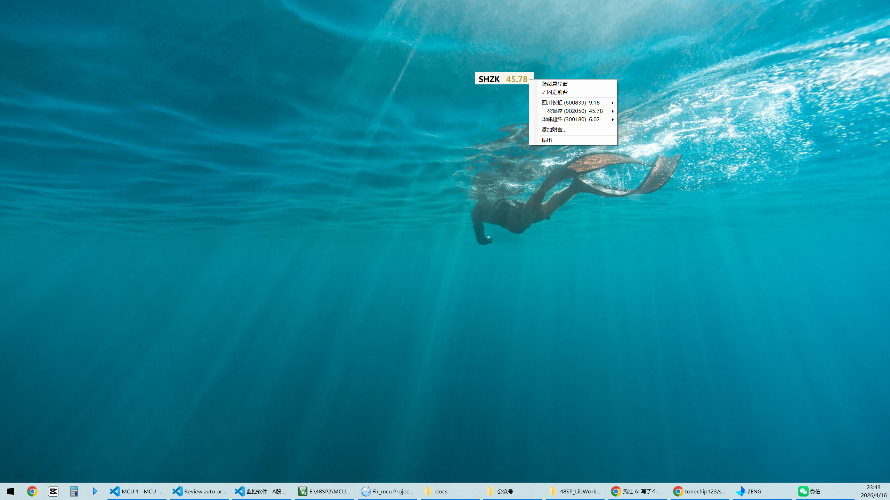
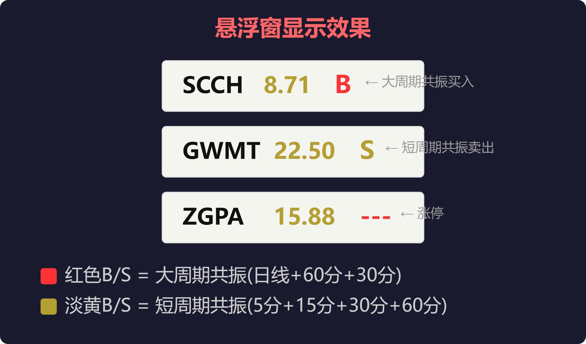
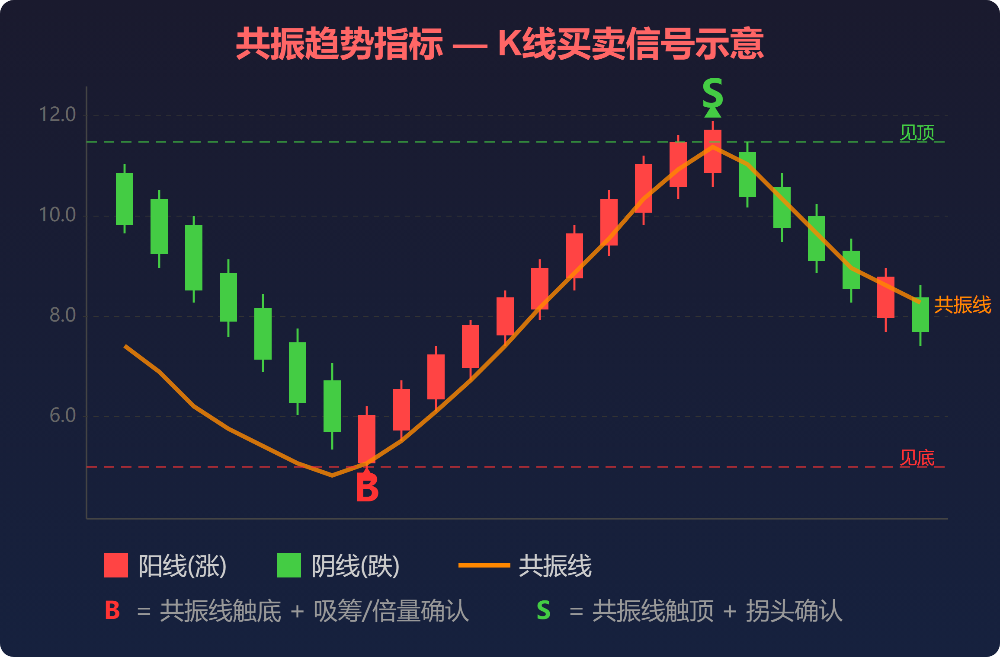

# 共振监控 (StockMonitor)

> A股悬浮小窗口实时行情监控 + 多周期共振趋势信号自动检测

[](LICENSE)
[](https://dotnet.microsoft.com/)
[]()

一个轻量级 Windows 桌面悬浮窗程序，实时显示A股自选股股价，内置共振趋势指标引擎，当多个周期同时发出买卖信号时自动提醒。**不干扰工作，一眼看盘。**

## 为什么不用通达信/同花顺？

| | 共振监控 | 通达信 | 同花顺 |
|---|:---:|:---:|:---:|
| 占屏空间 | 极小悬浮窗 | 整个窗口 | 整个窗口 |
| 多周期共振 | 自动计算 | 手动切周期看 | 手动切周期看 |
| 后台运行 | 悬浮置顶 | 必须前台 | 必须前台 |
| 干扰工作 | 不干扰 | 严重 | 严重 |
| 信号提醒 | 弹窗+声音+闪烁 | 需额外设置 | 需额外设置 |
| 启动速度 | 秒开 | 数十秒 | 数十秒 |

## 功能

- **悬浮小窗口** — 无边框置顶，拼音缩写 + 实时股价 + 信号(B/S)，可拖动到任意位置
- **实时行情** — 新浪行情API批量获取，收到即刷新，交易时段约1秒更新
- **双层共振信号**
  - 大周期共振（日线/60分/30分 ≥2个同方向）→ **红色B** / **绿色S** + 弹窗通知
  - 短周期共振（5分/15分/30分/60分 ≥2个同方向）→ **淡黄色B / S**
- **涨停检测** — 涨幅≥9.8%时股价后显示红色 `---`
- **信号通知** — 大周期共振触发：系统弹窗 + 声音 + 托盘图标闪烁
- **自选股管理** — 拼音首字母/代码/名称模糊搜索添加
- **自动升级** — 启动时检查新版本，一键下载替换重启
- **左键切换** — 点击悬浮窗切换下一只，15秒自动轮换
- **信号日志** — 按日期轮转，保留30天

## 截图

### 桌面实拍 — 悬浮窗 + 右键菜单



### 信号显示效果



### K线买卖信号示意



## 快速开始

### 方式一：直接下载（推荐）

下载编译好的exe，双击即用，无需安装任何依赖：

**[下载 StockMonitor.exe](http://8.147.70.248:8080/tools/StockMonitor.exe)** (~108MB，内嵌.NET运行时)

### 方式二：从源码编译

```bash
# 环境要求: .NET 9 SDK + Windows 10/11
git clone https://github.com/tonechip123/stock-monitor.git
cd stock-monitor

# 编译运行
dotnet run --project StockMonitor

# 发布独立exe（双击即用）
dotnet publish StockMonitor/StockMonitor.csproj -c Release -r win-x64 --self-contained -p:PublishSingleFile=true
# 输出: StockMonitor/bin/Release/net9.0-windows/win-x64/publish/StockMonitor.exe
```

## 使用说明

1. 双击 `StockMonitor.exe`，屏幕右侧出现悬浮小窗口
2. **右键**悬浮窗 → "添加财富" → 输入拼音/代码搜索 → 双击选中
3. **左键**点击悬浮窗 → 切换下一只
4. **拖动**悬浮窗到你喜欢的位置
5. 交易时段自动拉取K线并计算共振信号
6. 大周期共振触发时弹窗+声音+图标闪烁，双击托盘图标停止

## 架构

```
StockMonitor/
├── Api/
│   ├── EastMoneyClient.cs      东方财富API (K线+搜索联想)
│   ├── SinaQuoteClient.cs      新浪实时报价 (批量获取)
│   └── StockQuote.cs           报价DTO
├── Monitor/
│   ├── ResonanceMonitor.cs     多周期共振监控器
│   ├── SignalLogger.cs         信号日志 (按日轮转)
│   └── Models/
│       └── WatchStock.cs       自选股+共振状态
├── UI/
│   ├── FloatingBar.cs          悬浮小窗口
│   └── AddStockForm.cs         添加股票对话框
├── lib/
│   └── StockMonitor.Indicator.dll  共振趋势指标引擎 (预编译)
├── TrayApplicationContext.cs   托盘主逻辑
├── TrayIconRenderer.cs         动态图标渲染
├── WatchlistManager.cs         自选股持久化
├── AutoUpdater.cs              自动升级
└── Program.cs                  入口点
```

## 指标引擎

共振趋势指标引擎以预编译DLL提供 (`lib/StockMonitor.Indicator.dll`)：

| 模块 | 说明 |
|------|------|
| `TdxFunctions` | 通达信基础函数 (SMA/EMA/HHV/LLV/REF等) |
| `ResonanceIndicator` | 共振趋势计算 (多维RSV融合 → 3K-2D平滑 → 动态参考线 → 买卖信号) |
| `KlineBar` | K线数据结构 |
| `SignalResult` | 信号结果 (Buy/Sell/None) |

如需替换为自己的指标引擎，实现相同接口即可。

## 数据源

| 用途 | API | 说明 |
|------|-----|------|
| 实时报价 | 新浪行情 | 批量获取，~200ms响应 |
| K线数据 | 东方财富 | 5分/15分/30分/60分/日线，前复权 |
| 搜索联想 | 东方财富 | 拼音/代码/汉字模糊搜索 |

所有数据来自免费公开API，无需申请token。

## 技术栈

- **C# / .NET 9** — WinForms，零NuGet依赖
- **独立部署** — 内嵌.NET运行时，双击即用
- **新浪行情** — 批量实时报价，后台轮询收到即刷新
- **东方财富** — K线历史数据 + 搜索联想API

## License

[MIT](LICENSE) — 自由使用、修改、分发。
